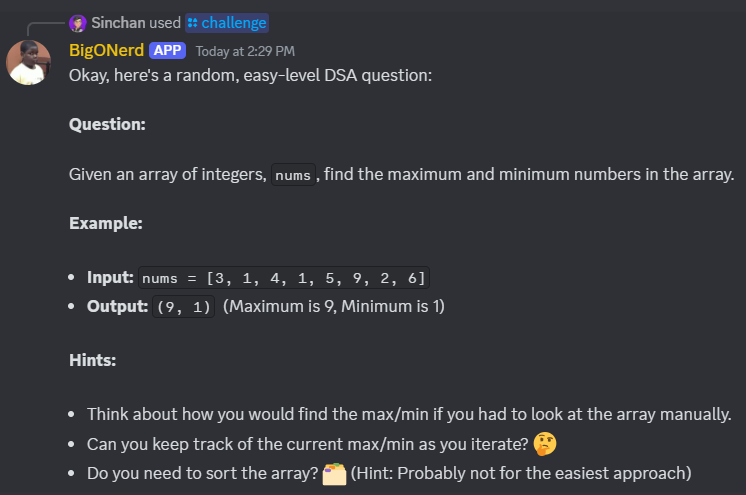
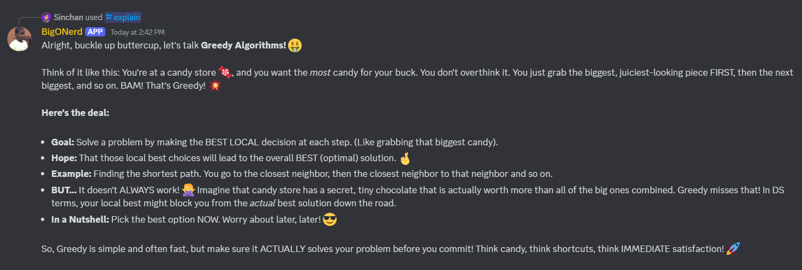
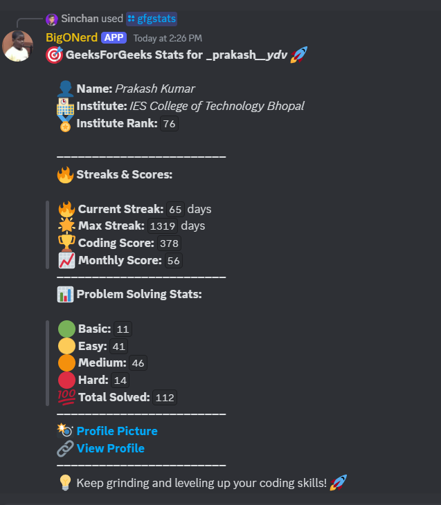
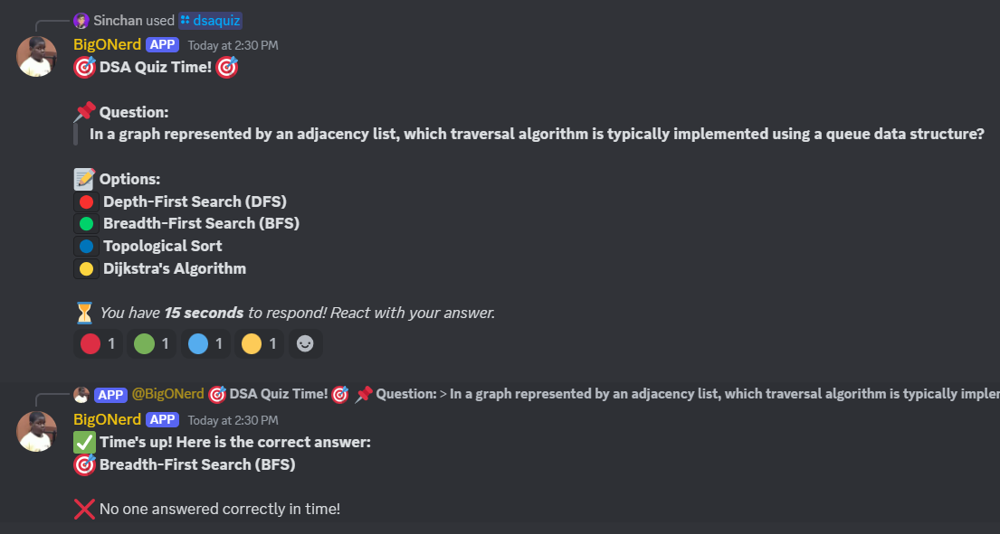

---

# **BigONerd - AI Powered Discord Bot**  
A powerful Discord bot that provides **DSA challenges, quizzes, memes, topic explanations, and coding stats** from LeetCode and GFG! 🚀  

## **📌 Features**  
✅ **DSA Challenges** – Get random **DSA problems** based on difficulty.  
✅ **GFG & LeetCode Stats** – Fetch your latest **coding stats** from **GeeksforGeeks** & **LeetCode**.  
✅ **DSA Quiz** – Participate in fun **DSA quizzes** with automatic answer checking.  
✅ **Topic Explainer** – Ask the bot to **explain** any programming topic. 📖  
✅ **Funny Memes & Jokes** – Get **random DSA-related memes & jokes** for a good laugh! 😂  

---

## **⚙️ Tech Stack**  
🔹 **Node.js** – Backend runtime  
🔹 **Discord.js** – Discord API library  
🔹 **Gemini API** – For AI-powered responses  

---

## 📷 Screenshots

DSA Challenge [easy, medium, hard]


AI Explains DSA related Question


User Stats of GFG/LeetCode


Quic Quiz


---

## Add Bot to your Discord Server 👍

```
https://discord.com/oauth2/authorize?client_id=1349287918622998560&permissions=2147485696&integration_type=0&scope=bot
```

## **🛠 Setup & Installation**  

### **1️⃣ Clone the Repository**  
```bash
git clone https://github.com/prakash-ydv/DiscordBot
cd DiscordBot
```

### **2️⃣ Install Dependencies**  
```bash
npm install
```

### **3️⃣ Set Up Environment Variables**  
Create a `.env` file and add:  
```
TOKEN=your_discord_bot_token
GUILD_ID=your_guild_id
OPENAI_API_KEY=your_openai_key
```

### **4️⃣ Start the Bot**  
```bash
node bot.js
```

---

## **📝 Available Commands**  

| Command           | Description 📜 |
|------------------|----------------------------|
| `/challenge`  | Get a **random DSA problem** based on difficulty 🎯 |
| `/dsaquiz`    | Participate in a **DSA quiz** with auto-checking 📊 |
| `/gfgstats`   | Fetch your **GFG profile stats** 📈 |
| `/leetcodestats` | Fetch your **LeetCode stats** 📊 |
| `/explain <topic>` | Get a **simple explanation** for a DSA topic 📖 |
| `/dsameme`    | Get a **funny DSA meme or joke** 😂 |

---

## **📂 Project Structure**  

```
📁 discord-dsa-bot
 ┣ 📁 API
 ┃ ┣ 📄 aiCalls.js        # Handles AI-powered 
 ┃ ┣ 📄 gfgAPI.js         # Fetches GFG user stats
 ┃ ┣ 📄 leetcodeAPI.js    # Fetches LeetCode user stats
 ┣ 📁 commands
 ┃ ┣ 📄 challenge.js      # Handles DSA challenge command
 ┃ ┣ 📄 dsaquiz.js        # Handles quiz command
 ┃ ┣ 📄 explain.js        # Handles topic explanations
 ┃ ┣ 📄 gfgstats.js       # Fetches GFG stats
 ┃ ┣ 📄 leetcodestats.js  # Fetches LeetCode stats
 ┣ 📄 bot.js            # Main bot file
 ┣ 📄 package.json        # Dependencies & scripts
 ┣ 📄 .env                # Environment variables
```

---

## **📞 Contact & Support**  
🛠 **Maintainer:** [Prakash Kumar](https://www.linkedin.com/in/prakash-kumar-jh09/)
📩 **Issues & Contributions:** Open a GitHub issue or PR!  

---
